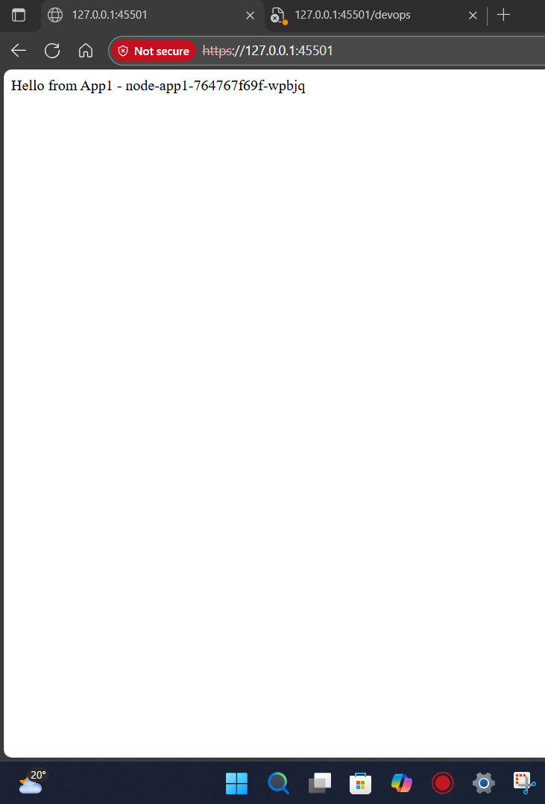
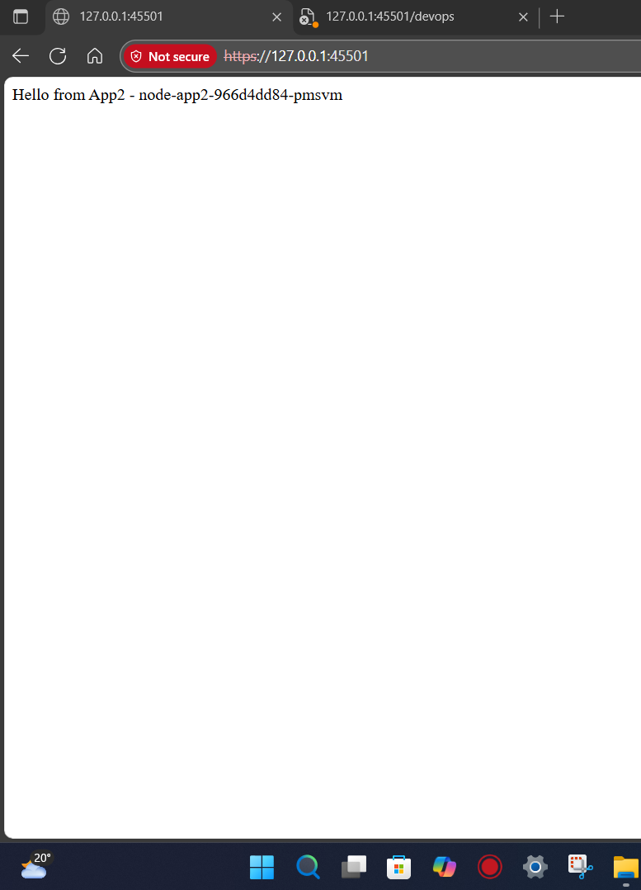
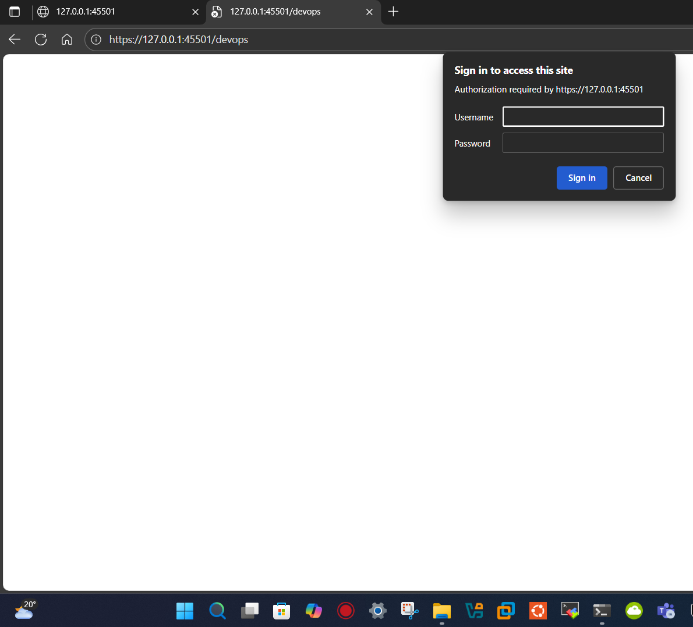
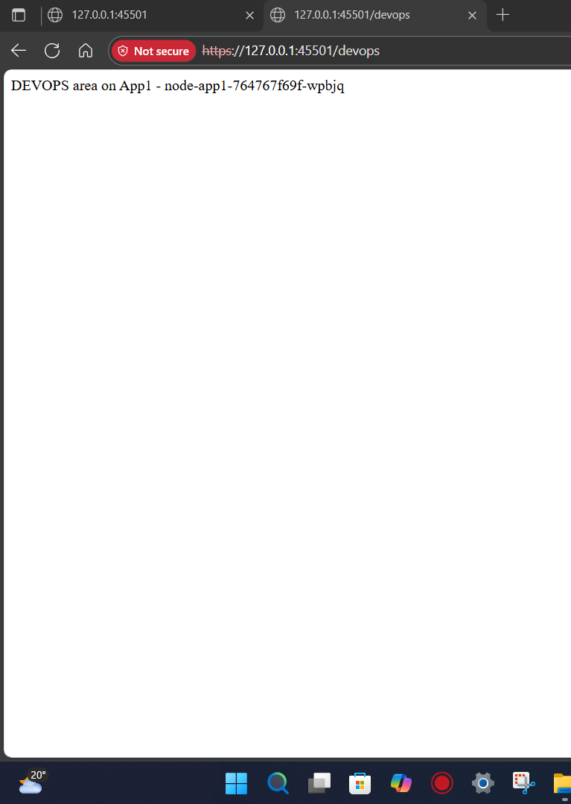
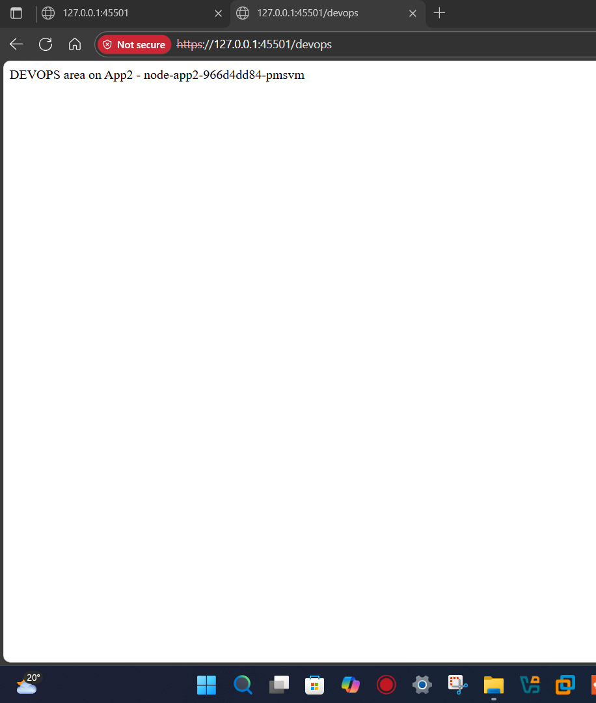

# K8s Reverse Proxy with Auth and SSL

## Project Overview

This project demonstrates a Kubernetes deployment of two simple Node.js applications behind an Nginx reverse proxy. The setup includes:

- **Load Balancing**: Nginx distributes traffic between two Node.js apps (app1 and app2).
- **SSL Termination**: HTTPS enforcement with self-signed certificates.
- **Basic Authentication**: Protected `/devops` route requiring username/password.
- **Kubernetes Resources**: Deployments, Services, ConfigMaps, and Secrets for secure configuration.

The applications are basic Express.js servers responding with "Hello from AppX" on `/` and "DEVOPS area on AppX" on `/devops`.

## Prerequisites

- Docker installed and running
- Kubernetes cluster (Minikube recommended for local development)
- `kubectl` configured to interact with your cluster
- Apache2-utils (for `htpasswd` command)
- Docker Hub account (or private registry) for pushing images

## Setup Steps

### 1. Clone and Navigate to Project Directory

```bash
cd k8s-reverse-proxy-auth-ssl/
```

### 2. Generate SSL Certificates

Create self-signed certificates for HTTPS:

```bash
mkdir -p nginx/certs
openssl req -x509 -nodes -days 365 \
  -newkey rsa:2048 \
  -keyout nginx/certs/localhost.key \
  -out nginx/certs/localhost.crt \
  -subj "/CN=localhost/O=LocalDev"
```

### 3. Set Up Basic Authentication

Install apache2-utils if not present:

```bash
sudo apt-get update
sudo apt-get install -y apache2-utils
```

Create password file (change 'admin' and 'password' as needed):

```bash
htpasswd -cb nginx/.htpasswd admin password
```

### 4. Build and Push Docker Images

Build the application and Nginx images:

```bash
docker build -t ibrahimmintal/node-app1:latest ./app1
docker build -t ibrahimmintal/node-app2:latest ./app2
docker build -t ibrahimmintal/nginx-reverse-proxy:latest ./nginx
```

Push to Docker Hub (replace with your registry if needed):

```bash
docker push ibrahimmintal/node-app1:latest
docker push ibrahimmintal/node-app2:latest
docker push ibrahimmintal/nginx-reverse-proxy:latest
```

### 5. Start Minikube and Deploy

Start your Kubernetes cluster:

```bash
minikube start
```

Login to Docker (if required):

```bash
docker login
```

### 6. Create Kubernetes Secrets

Create secrets for SSL certificates and authentication:

```bash
kubectl create secret tls nginx-certs \
  --cert=nginx/certs/localhost.crt \
  --key=nginx/certs/localhost.key \
  --dry-run=client -o yaml | kubectl apply -f -

kubectl create secret generic nginx-htpasswd \
  --from-file=.htpasswd=nginx/.htpasswd \
  --dry-run=client -o yaml | kubectl apply -f -
```

### 7. Deploy Applications and Proxy

Apply all Kubernetes manifests:

```bash
kubectl apply -f k8s/app1-deployment.yml
kubectl apply -f k8s/app2-deployment.yml
kubectl apply -f k8s/proxy-deployment.yml
kubectl apply -f k8s/proxy-service.yml
kubectl apply -f k8s/app1-service.yml
kubectl apply -f k8s/app2-service.yml
kubectl apply -f k8s/proxy-ConfigMap.yml
```

### 8. Wait for Pods to be Ready

Monitor pod status:

```bash
kubectl get pods
```

Wait until all pods show `Running` status.

### 9. Access the Application

Get the service URL:

```bash
minikube service nginx-service --url
```

This will provide a URL like `https://192.168.49.2:30443`. Access it in your browser.

**Note**: Since we're using self-signed certificates, your browser will show a security warning. Accept the risk to proceed.

## Testing the Setup

- **Root path (`/`)**: Should load balance between app1 and app2, showing "Hello from AppX".
- **DevOps path (`/devops`)**: Will prompt for authentication (admin/password), then show "DEVOPS area on AppX".
- **HTTPS enforcement**: HTTP requests are automatically redirected to HTTPS.

## Results

Screenshots of the deployed application:

### Direct Access to Applications
<table>
  <tr>
    <td></td>
    <td></td>
  </tr>
  <tr>
    <td align="center">App1</td>
    <td align="center">App2</td>
  </tr>
</table>

### Authentication Prompt for /devops


### Authenticated Access to /devops
<table>
  <tr>
    <td></td>
    <td></td>
  </tr>
  <tr>
    <td align="center">DevOps on App1</td>
    <td align="center">DevOps on App2</td>
  </tr>
</table>

## Cleanup

To remove all resources:

```bash
kubectl delete -f k8s/
kubectl delete secret nginx-certs nginx-htpasswd
minikube stop
```

## Architecture

```
Internet -> Nginx (SSL/Auth) -> Load Balancer -> App1 Service -> App1 Pod
                                      |                    -> App2 Service -> App2 Pod
```

Nginx handles SSL termination, basic auth for `/devops`, and load balancing across the two applications.
